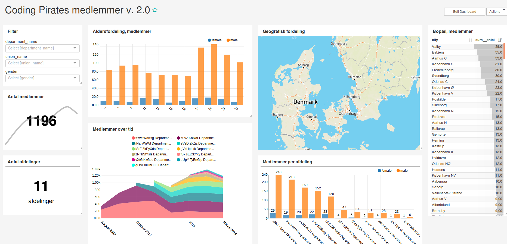

# Visualisering af Coding Pirates data
Dette repository indeholder de nødvendige komponenter til at opsætte
en installation af
[superset](https://github.com/apache/incubator-superset) med diverse
visualiseringer af udtræk fra Coding Pirates medlemsdatabasen.

## Screenshot
Currently the data in this screenshot is randomly generated:


## Opsætning

1. For at kunne visualisere data fra medlemssystemet, skal
   databasetabellerne aggregeres, og opstilles med en tabelrække per
   tidsperiode fremfor per person. Scriptet ```mk_aggregated_db.sh```
   laver en kopi af medlemsdatabasen og opretter de nødvendige
   aggregerede tabeller i denne kopi.
   
   - I scriptet skal variablerne ```MEMBERS_DB``` og
     ```AGGREGATED_DB``` rettes til at pege på den eksisterende
     medlemsdatabase og hvor kopien med de aggregerede tabeller skal
     placeres.
   
   - Opsæt et cronjob der dagligt afvikler scriptet ```mk_aggregated_db.sh```


2. Følg installationsvejledningen til "superset":
   http://superset.incubator.apache.org/installation.html

3. Tilføj database i superset
     - Login på superset
     - Tilgå "Sources -> Databases" og tryk på "+"-knappen øverst til
       højre
     - Skriv et passende navn og stien til sqlite-databasen
       ```sqlite:///sti/til/db.sqlite3``` Resten af indstillingerne
       kan blive som default.
       
4. Tilføj database-tabeller i superset
    - Tilgå "Sources -> Tables" go tryk på "+"-knappen øverst til højre
    - Vælg den netop uploadede database og indtast tabelnavnet: ```dataviz_members_grouped```.

5. Rediger kolonne-indstillinger. Superset kan af ukendte årsager ikke
   inferrere datatyperne for nogle af kolonnerne. Ret derfor tabellen
   der lige er tilføjet og lav følgende rettelser:
     - ret "antal" til at være type INT og kryds af i "Sum".
     - ret "timeperiod" til atvære type "DATE" og kryds af i "Groupable" og "Is temporal"
     - sæt kryds i "Groupable" ud for "age", "gender", "city", "region", "chapter_name" og "union_name"
     - sæt kryds i "Filterable" ud for "gender", "city", "region", "chapter_name" og "union_name"
     - sæt kryds i "Count Distinct" ud for "chapter_name" og "union_name"
     
   Gå tilbage til Detail siden og tryk Save.

5. Importer dashboard via menuen "Manage -> Import Dashboards" og
   upload filen ```cp-member-dashboard.pickle```
 

## Begrænsninger
Visualiseringerne er begrænset af det data vi har. Pt. er det kun de
færreste frivillige der har oprettet sig i medlemssystemet, så vi kan
ikke sige noget særligt om de frivillige. Ligeledes er det uklart om
frivillige der ikke længere er med vil blive stående i systemet.

Ventelisten kan heller ikke visualiseres over tid, men kun i den
nuværende tilstand, da der i den nuværende model bliver slettet
information fra databasen når børn ikke længere står på ventelisten.

Derudover er der en lang række data om Coding Pirates, som der
potentielt også kunne have været interessant at kigge nærmere på. For
eksempel kunne man forestille sig at udvide med statistik
eksporteret fra Google Analytics, Facebook-sider, Slack, m.m.
